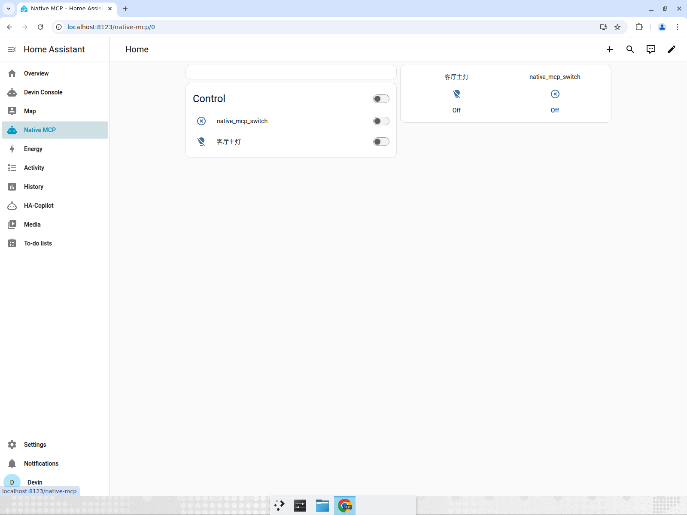
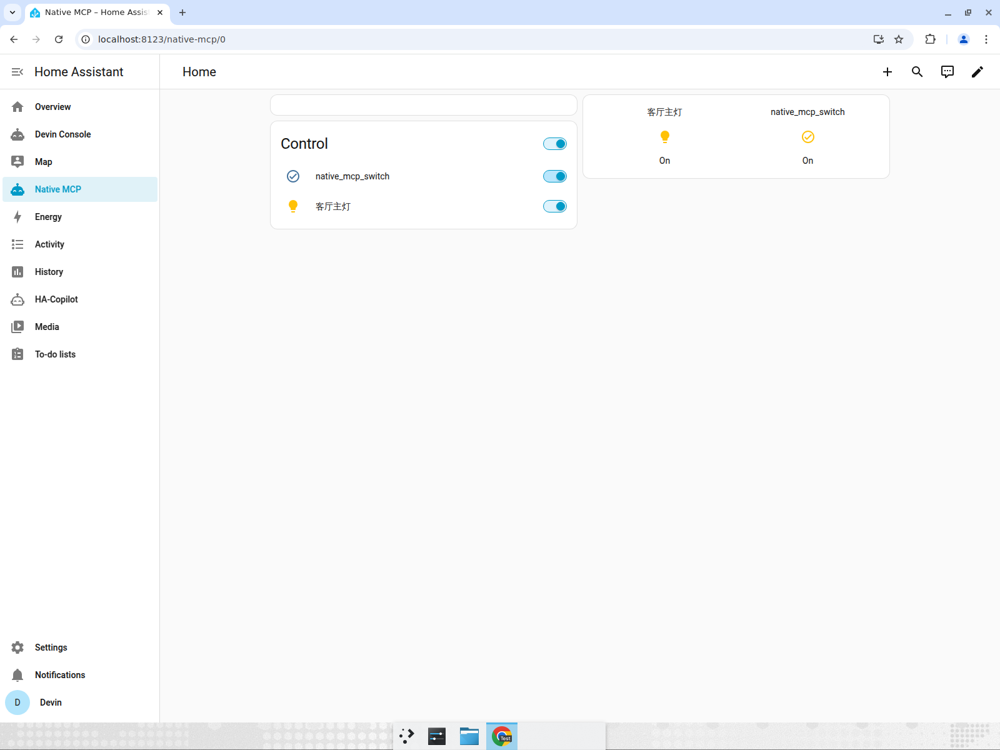
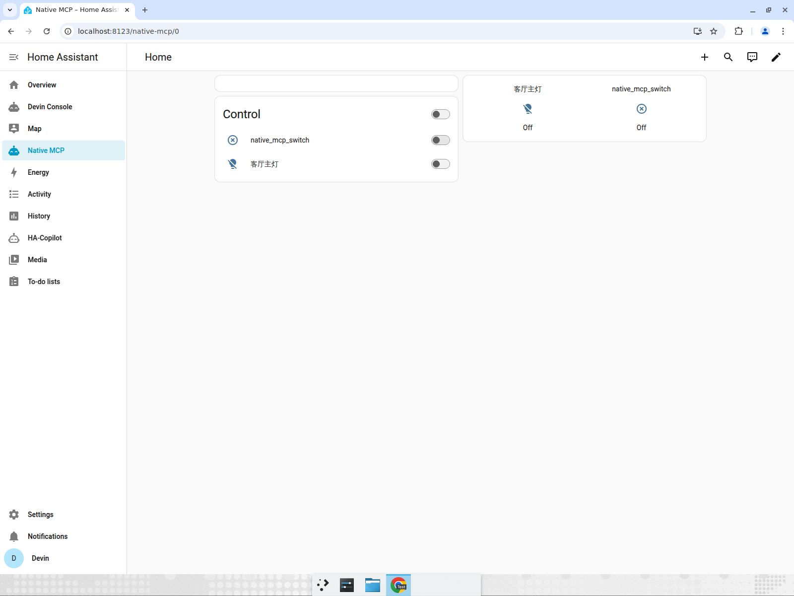
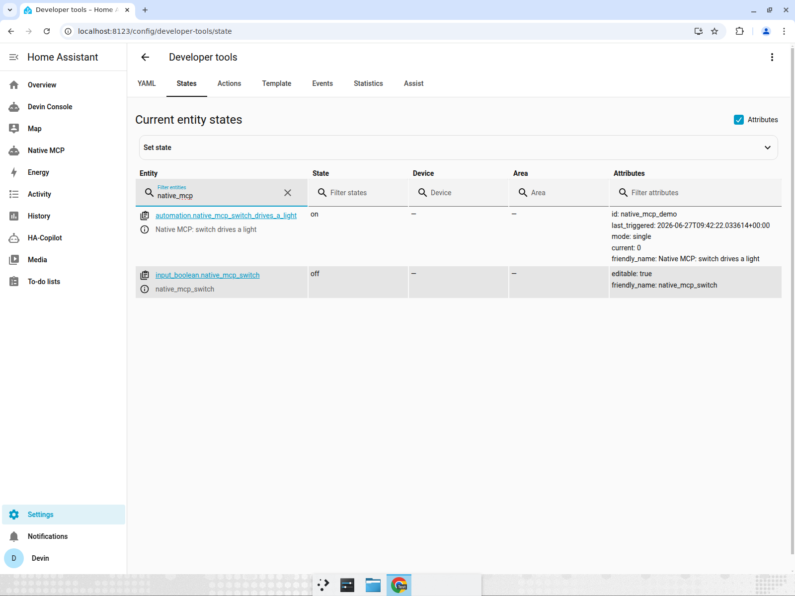

# Native MCP — UI test report

**Subject:** `ha_copilot` now serves a native, public MCP endpoint at
`POST /api/ha_copilot/mcp`. The switch, automation, and dashboard exercised below
were **all created through that endpoint** (`native_demo_build.py`). Their correct
behavior in the live HA UI is the proof the endpoint is a real control plane, not
a toy.

**Result: 3/3 UI tests passed. Automated acceptance: `native_selfcheck.py` = 21/21,
idempotent across consecutive runs with zero residue.**

Recording of the full flow is attached to the PR / chat.

---

## Test 1 — Native-MCP automation drives a light from the dashboard — PASS

Page: `/native-mcp` (the dashboard created via MCP).

| Step | Expected | Observed |
|---|---|---|
| Precondition | switch Off, 客厅主灯 Off | both Off ✔ |
| Toggle switch → On | light flips On via MCP-created automation | 客厅主灯 → On ✔ |
| Toggle switch → Off | light flips Off | 客厅主灯 → Off ✔ |

Precondition (both Off):

Switch On → light On (automation fired live):

Switch Off → light Off (bidirectional):

## Test 2 — Automation is a real, persisted entry that actually fired — PASS

The automation `automation.native_mcp_switch_drives_a_light` (`id: native_mcp_demo`,
authored via MCP `create_automation`) shows `last_triggered: 2026-06-27T09:42:22`,
having moved from "Never" — proving it fired live during Test 1. Verified via
Developer Tools → States (the config-editor list page hit a transient frontend
load glitch, so States is used as the more reliable witness):

## Test 3 — Dashboard renders MCP-authored cards — PASS

The `/native-mcp` dashboard renders its MCP-authored "Control" entities card and
the glance card (see Test 1 screenshots). Both reflect live entity state.

---

## Defect found & fixed during testing

`native_selfcheck.py` restored the yaml-backed configs (automations/scenes/scripts)
but the entities those configs had registered lingered as **"unavailable" registry
orphans**, accumulating across runs (11 found and purged). Fixed by sweeping the
entity registry for `mcp_auto_/mcp_scene_/mcp_script_` entities after the reload and
removing them — scene entity_ids are sticky to first creation, so the sweep matches
by name pattern, not the per-run suffix. Re-verified: 21/21, **zero** residual
orphans across consecutive runs.
