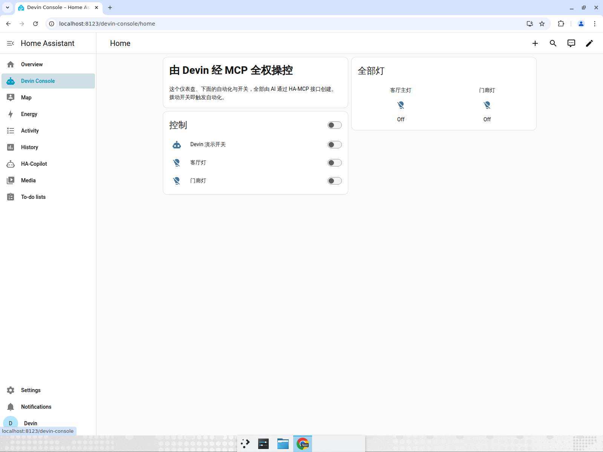
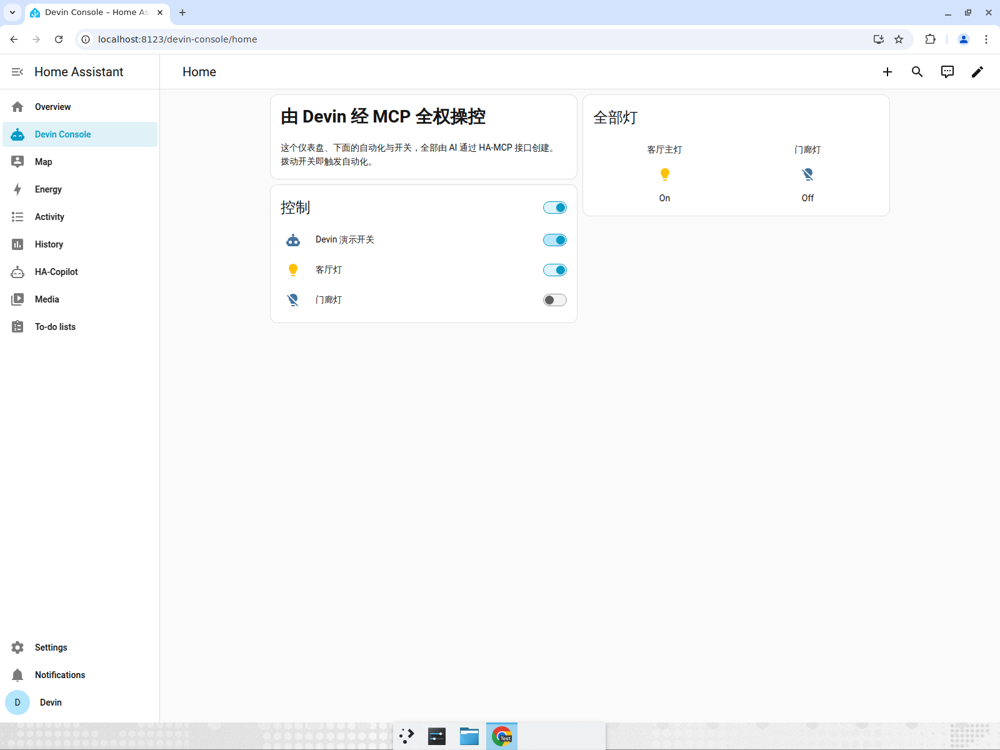
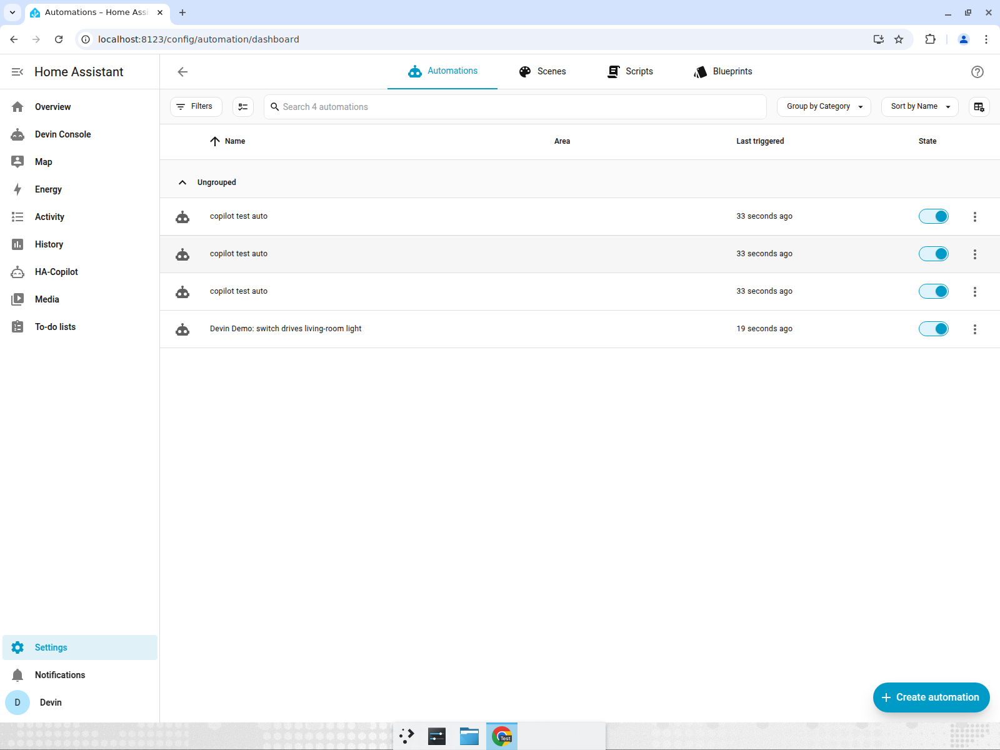

# HA-MCP Bridge — End-to-End Test Report

**Re-anchored model:** Devin (the strong external agent) is the operator; the
HA-MCP bridge is a thin, complete control layer over Home Assistant — "Cursor
for Home Assistant." Devin drives every user-operable HA module through typed
MCP tools.

## 1. Automated self-check (real MCP protocol over stdio)

`python -m ha_mcp.selfcheck` spawns the server as a subprocess, speaks the real
MCP protocol to it, and drives every major module with closed-loop verification
and cleanup. Fully idempotent (runs repeatedly without contamination).

```
==== 29/29 passed ====
```

Covered: overview, services, states/services, templates, set_state, history,
error log, floors, areas, entity assignment, devices, labels, helpers,
automations (save + read-back verify), scenes, scripts, dashboards (config
read-back), users, config entries, system health, logbook, config validation,
escape hatches (`ha_rest`, `ha_ws`), and cleanup.

## 2. Live UI demo — agent builds and operates HA through the bridge

`ha_mcp/examples/build_console.py` drove the live HA **entirely through MCP** to
create durable, user-visible artifacts: an admin user, an `input_boolean`
switch, a real automation, and a custom "Devin Console" dashboard. Everything
below was then verified in the HA frontend.

### 2.1 MCP-created dashboard renders; lights start Off

The "Devin Console" dashboard (built via MCP) appears in the sidebar with a
markdown card, an entities/control card, and a glance card. Precondition: switch
off, 客厅灯 and 门廊灯 both Off.



### 2.2 Toggling the MCP switch fires the MCP automation — 客厅灯 On

Toggling "Devin 演示开关" triggers the automation
(`switch on -> light.turn_on living-room`): 客厅灯 turns **On** (glance card
"On"), 门廊灯 stays Off.



### 2.3 Automation is a real, persisted, editable HA automation

"Devin Demo: switch drives living-room light" is listed in
**Settings → Automations**, "Last triggered 19 seconds ago" — proving it is a
first-class HA automation, not a side effect.



## 3. Defects found and fixed in practice

| # | Defect | Fix |
|---|--------|-----|
| 1 | `call_service` sent WS-style nested `target` to REST | merge target keys flat into body |
| 2 | Empty list conveyed as `null` over MCP | bridge treats zero data as `[]` |
| 3 | Bare `-> list` annotation → no `structuredContent`; 1-element list read back as a dict | annotate list tools `list[dict]` (`list[list]` for history) for stable `{"result": [...]}` |
| 4 | `get_history` output failed schema validation (list-of-lists) | annotate `list[list]` |
| 5 | Idempotency collisions on reruns | unique per-run suffixes + explicit cleanup |
| 6 | Write-read race in verification | read back persisted config, not `list_*` |
| 7 | Delete verification raised on 404 | treat 404 as "resource gone" success |
| 8 | Dashboard `url_path` without hyphen rejected by HA | use hyphenated url path |

## How to reproduce

```bash
export HA_BASE_URL=http://localhost:8123
export HA_TOKEN=<long-lived access token>
python -m ha_mcp.selfcheck            # 29/29
python ha_mcp/examples/build_console.py
```
