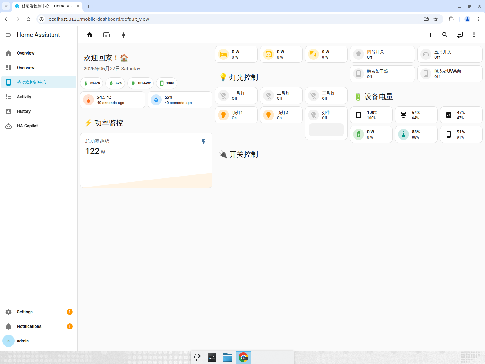
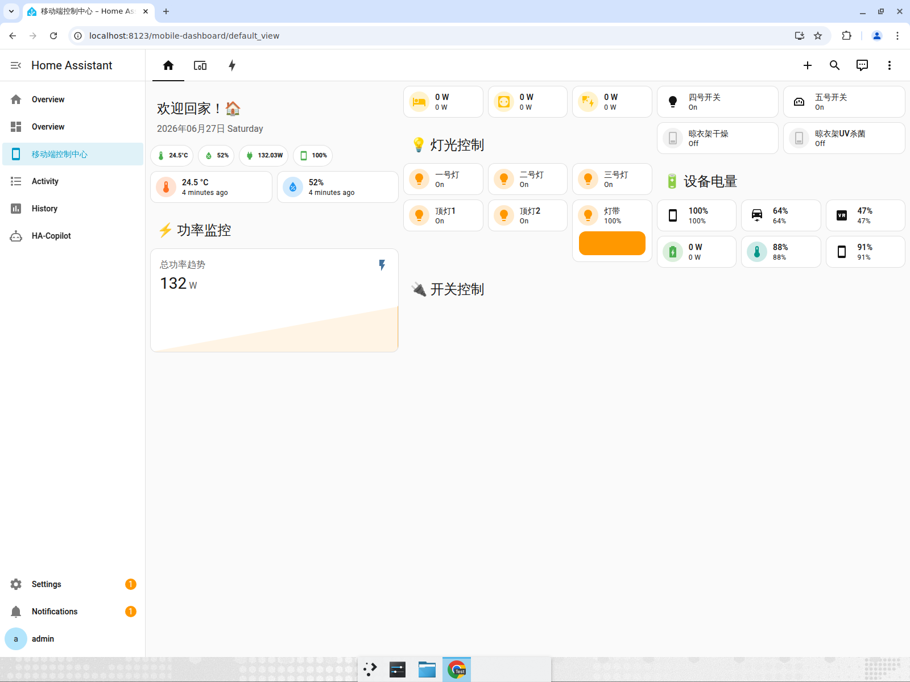
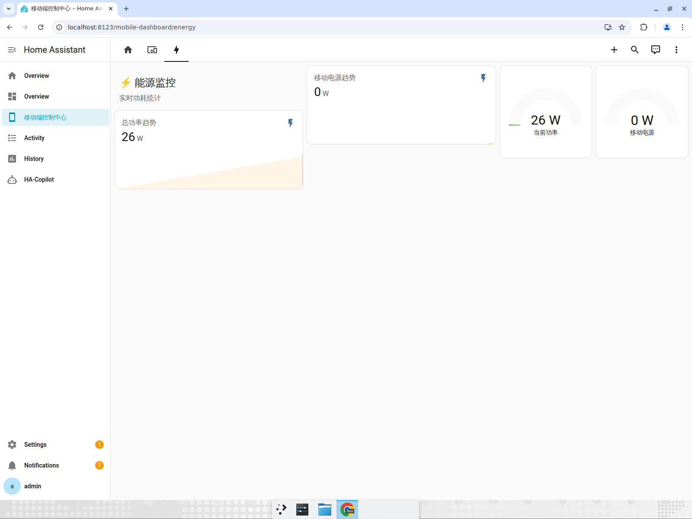
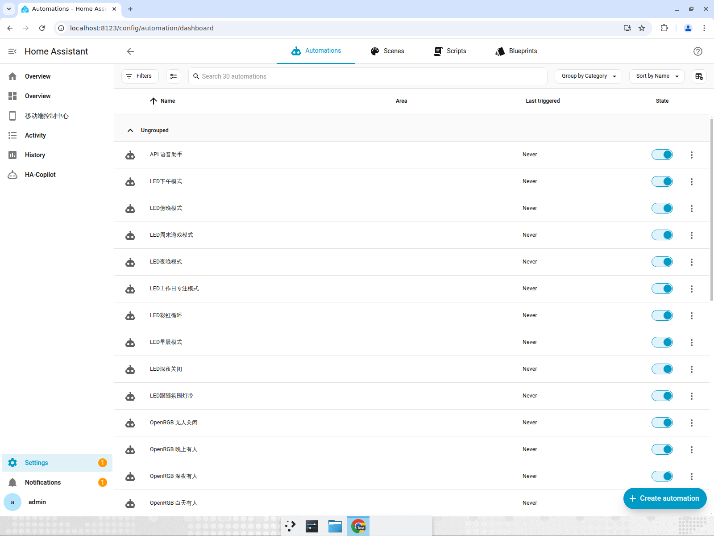

# Operational Test Report — Real HA driven via native MCP

**Target:** the user's real Home Assistant config, redeployed on Devin's VM
(HA 2026.3.4, Docker) and operated entirely through the native MCP endpoint
`POST /api/ha_copilot/mcp`.

**Result:** all operational tests passed. 257 entities loaded, 0 functional
entities unavailable (digital twin), 30/30 automations enabled and firing,
energy pipeline accumulating, mushroom dashboards rendering live.

## Infrastructure

| Piece | State |
|-------|-------|
| Home Assistant | 2026.3.4, RUNNING, "My Home", Asia/Urumqi |
| Entities | 257 loaded |
| MQTT digital twin | Sonoff plugs+power, switches, lights, fans, power stations, temp/humidity + battery sensors |
| Native MCP | `/api/ha_copilot/mcp`, 29 tools, JSON-RPC over HTTP |

## Tests

### 1. Mobile dashboard renders live (digital-twin backed)
The user's `移动端控制中心` (mushroom) dashboard renders fully with live chips,
light/switch cards, power gauges and battery levels.

### 2. Bulk light control via MCP
10 `light.turn_on` / `light.turn_off` calls issued through the MCP `call_service`
tool. All cards reflected state; total power tracked the change live
(132W → 26W on all-off).

### 3. Energy pipeline live (Riemann → utility_meter)
`能源监控` view shows live total-power trend (~26W) + gauges; cumulative
`sensor.sonoff_total_energy` accumulating (0.068 kWh observed and rising).

### 4. Automations loaded and firing
All **30** of the user's automations enabled. Several show `Last triggered`
2–5 minutes ago — fired in response to the MCP-driven device changes
(e.g. `打开四号时打开五号`, `关闭4号时自动关闭5号`).

## Defects found & fixed

| # | Defect | Fix |
|---|--------|-----|
| 1 | `ha_ws` crashed: `ActiveConnection.__init__` signature drift (HA 2026.3.4 removed `remote`, made `refresh_token` required) | Introspect signature at runtime; pass only accepted params; reuse a real refresh token or minimal stand-in |
| 2 | All energy meters `unknown`: Riemann sensors had pinyin entity_ids; `utility_meter` sources expected `sensor.sonoff_<id>_energy` | Realign energy entity_ids to source via MCP registry |
| 3 | Riemann sensors never ticked: jitter rounded standby power to 1dp so state never changed | Round to 2dp, widen variance to ±15% |
| 4 | 13 registry orphans (UI-created, no YAML) | Purge via MCP |
| 5 | Mobile dashboard failed to load: missing mushroom/card-mod JS + broken `!include` | Materialize vendor JS, remap `/hacsfiles/`→`/local/community/`, add missing twin sensors |
